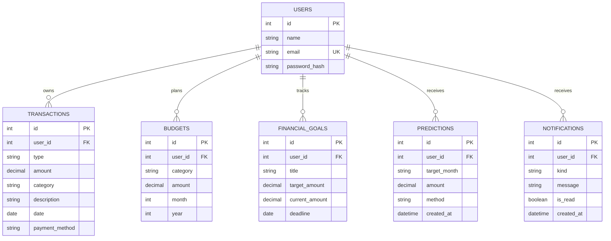

# FinSight data model

Indexes support user/date and user/category transaction queries. A unique user/category/month/year key prevents duplicate budgets. Passwords are salted scrypt hashes; raw passwords are never stored. All financial records are owner-scoped.
